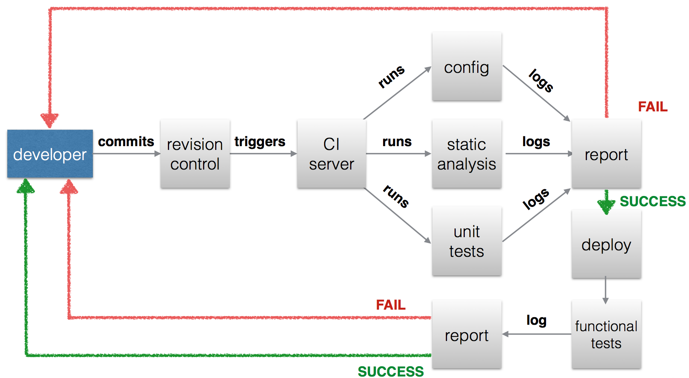

# Welcome to the Continuous Integration side

> “Continuous Integration” is a software development practice where members of a team integrate work frequently, usually each person integrates at least daily - leading to multiple integrations per day. Each integration is verified by an automated build (including tests) to detect integration errors as quickly as possible.
>
> — Martin Fowler

**For the impatients**: skip the history lesson and <a href="#ignition">ignite your Drupal website</a>.

## Tools

Since the beginning of times the hard coupling between data and configuration in the database caused developers quite a few headaches when it came time to share or move data around environments. Scenarios like collaborative teamwork, deployments and data pubblication have always been troublesome: how could they integrate their work if almost all of their modifications were deep down their own databases? How could they extract only the relevant slices of information and publish them on another instance of the website?
The easiest solution was to work on a common development server, where all developers were making modifications at the same time; another option was to work locally and then replicate everything on the development environment and dumping everything back again regularly.
Of course there were other possibilities too, for the strongs of heart.

In other words it wasn't quite a comfortable and scalable situation.

At that time, dumping and restoring databases around and going through endless checklists of manual operations was the only viable option to hit production: many found that situation to be so bad and unacceptable that the only option they saw was to leave Drupal behind in a trail of heavy criticism.

That was understandable and for quite many reasons, it was absolutely true: managing and deploying Drupal was a real, hard, unsolved problem.

Not all hope was lost though, as during the years several actors started playing together to try to overcome those limitations and make Drupal a tool easier to work with.

### Features was born

**Features** is module that allows configuration to be exported as a static text file in the form of a Drupal module: as a matter of fact features *are* Drupal modules, with some special additions. **Features** didn't come alone too, as whole handful of other modules -such as **Feature Override** and **Strongarm**- sprang and started populating its ecosystem, adding up useful functionalities and improving the Drupal ability to export its vast configuration.

Such module opened up a world of opportunities: by keeping a consistent, conventional and disciplined approach to development, it became possible for multiple developers to cooperate on the same website without the need for tedious point and click sessions for repeating the work over and over again. Database clashes became a remnant of the past(well, ish): configuration could be exported, versioned, compared, reviewed, patched, imported. Pretty much as any other good ol' frameworks! Great!

Theoretically. In practice, some modules lacked -completely or partially- integration and there was no way to properly import *real* data, such as nodes, users and taxonomy terms.

### Enter Migrate

**Migrate** is another very powerful and flexible module that deals with Drupal data imports. Its main goal is to provide an API that allows developers to easily map almost any kind of data source (csv files, databases, other Drupal installations, even Wordpress sites!) to a Drupal destination. In order to ease the development of such data imports (aka migrations), it's possible to leverage a broad set of built-in functions and classes that help during the whole process: for instance it's possible to leverage the MigrateDestinationEntity class (and its children) to easily model a target entity to export data to.

As all of the API goodness wasn't enough, a powerful set of commands was also made available: thanks to the Drush integration, it's possible to list, run and even rollback migrations, not to mention the many other utility commands that ship with the module.

### Drush up your life

Automation ain't no automation without a proper dose of Command Line. Drush possibly needs no introduction: the powerful DRUpal SHell is a godsent tool for effectively dealing with repetitive tasks and it's a crucial component when it comes to achieving a fully-working Continuous Integration flow. Commands like site-install, rsync and sql-sync are an irreplaceable help at deploy time.

### The Alien Invasion

It's no 2005 anymore and even Drupal started to acknowledge that: lots of tools, libraries and standards(with the unfortunate exception of Github and PSR-1 and PSR-2) made their way into the upcoming "8" Release, radically challenging the status quo and revolutionizing many aspect of this beloved CMS. We're going to see some of them, such as **Composer** and **PHPUnit** and we'll also introduce some other ones that are also quite common, such as **Phing**, **Jenkins** and **Behat**.

### Putting it all together

Drupal Ignite is the missing piece of the puzzle, or the glue that ties all the pieces together if you will. Put simply, it's not much more than a template and a Bash script: the former contains a set of files and folders with an opinionated view on how the project should be structured, while the latter it's just a utility that does the work of copying the template to a destination folder of your choice while replacing some variables for you.

## Ignition

In order to start using **Drupal Ignite** you need *surprise!*to download it in a directory of your choice, say **~/bin/drupal-ignite**.

Once you have the directory in place, make sure the *setup.sh* script is executable by running **chmod a+x ~/bin/drupal-ignite**.

Now you're almost good to go, as the only thing missing before starting the actual work on the website is to run the script itself, which accepts the following parameters:

* **docroot**, to specify the folder that is going to host your website's files, such as */var/www/my_drupal_website/*;
* **domain**, to specify the (real) for site's domain, such as *www.my_drupal_website.com*;
* **name**, to specify the name for the website, such as *MyDrupalWebsite*.

So the complete setup.sh invocation could look like this:

**./setup.sh --docroot=/var/www/my_company/my_website --domain=my-company.com --name="MyCompany"**

**PRO TIP:** if you don't specify any of the parameters above on the command line, the script will ask you to enter them interactively.

Et voilà: if no errors occurred, your website is ready to receive its first commit! :)

## Development

Ok now that you got your new Drupal website ignited, how does the development flow look like for, say, creating a simple multi-user blog?

Well, you'll probably start to create some **Content Types**, such as a *Blog* and a *Post*, each one featuring some custom **Fields**.

You'll also need a **Taxonomy** or two for categorization purposes and a couple **Views** to show the list of *Posts* for a given *Blog* and another list of *Posts* for each *Category*.

Also, users will need to have different roles for writers and reviewers, so you need to create those permissions too.

Maybe you'll also add a **Rule** to send an email to subscribed readers to inform them whenever a new *Post* gets published.

Then you'll probably need to integrate some styling, so you create a **Theme** featuring some css and javascript files and some php to do some hook magic.

It could also happen that you will need to lay out a little **Custom Module** for showing a block containing some ads from an exoteric advertisment company you have to integrate.

Oh, and how about the initial data? You'll probably need to create:

* some users with their blogs and some that just review the posts before publishing them;
* a set of basic categories;
* some initial blog posts with images.

Finally, having some acceptance tests to verify you implemented the business logic as agreed with the will both serve as an progress meter and as an insurance against future disasters.

How do we handle all of things above? Let's break them one by one to get an "bird's eye" overview:

* anything that defines the structure of your blog, such as **Content Types**, **Fields**, **Taxonomies**, **Views**, **Rules** and some **Variables** will be exported in a **Feature** called **SitenameBlog** and it will reside in */sites/all/modules/features/sitename_blog*;
* the custom theme you developed will reside in */sites/all/themes/sitename*;
* the custom module you developed will reside in */sites/all/modules/custom/exoteric_ad*;
* the initial data(users, categories, blogs, posts, etc) will be implemented in a migration module that will reside in */sites/all/modules/migrations/fixtures*;
* the (Behat) acceptance tests will reside in **/features**.

How all the single parts work will be subject of dedicated sections, so don't worry if it seems too much for now: there's even more to this than what we mentioned until now :)

We're getting closer to our first deploy now: after a (hopefully) good load of commits, all the pieces will start to fall into place so that at some point you'll feel you'll be ready to push your modifications to the central repository and start your first build.

After you push, here's what's going to happen:

Wow! Let's break that again, too:

Whenever you push, your Source Control Management system(let's assume it's **git** from now on) will store your commits on the filesystem.

Leveraging its **post_receive** hook, you'll be able to execute a script that triggers a URL exposed by **Jenkins** that will start the build.

**Jenkins** will clone the website repository and run the *bin/build.sh* file you can find in your website folder.

The *bin/build.sh* script will do three crucial things: it downloads **Composer**, it runs it to download the needed dependencies -**Phing** being the most important one- and then it will run **Phing**, which in turn will install the website, run the tests, run the code analysis tools and deploy the website to the destination.

If all of the above succeeds, the website gets deployed in a few minutes. If not, you'll get a report of failure and some nice logs to inspect to find what happened.

Now, this is how the whole process works. Of course there's A LOT of possible tweaks to optimize and adapt the process to a specific process needs: we're going to dive deeper in each topic in the next articles.

Almost forgot! I also prepared some slides on this topic to aid you in learing these topics. You can download them in <a href="assets/00_intro_eng.pdf">English</a> or <a href="assets/00_intro_ita.pdf">Italian</a>

That's all for now, I realy hope you'll find Drupal Ignite useful! Feel free to shoot questions and feedback at me via twitter or email.

[@omissis](http://twitter.com/omissis)

[tenwarp.com](http://tenwarp.com)
